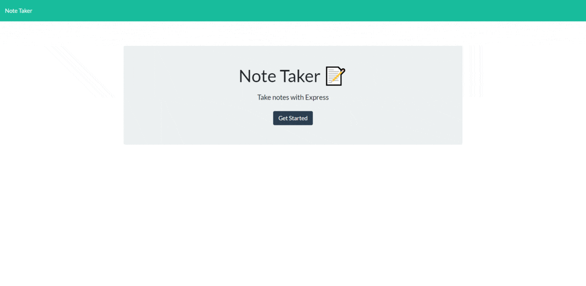

# Note Taker

## Description

This helps you keep track of everyday life and stay focused on what needs to be done. You will be able to take down notes and title those notes for easy access later. Feel free to take as many notes as you need and stay organized in life!

---

## Table of Contents

-   [Installation Instructions](#installation-instructions)
-   [Usage Information](#usage-information)
-   [License](#license)
-   [Contribution Guidelines](#contribution-guidelines)
-   [Test Instructions](#test-instructions)
-   [Questions](#questions)

---

## Installation Instructions

This application requires Node.js which can be downloaded <a href="https://nodejs.org/en/" target="_blank">here</a>. It utilizes a node module called <a href="https://expressjs.com/" target="_blank">express</a> and can be installed using <a href="https://www.npmjs.com/" target="_blank">node package manager</a>. It also utilizes a node module called <a href="https://www.npmjs.com/package/uuid" target="_blank">uuid</a> and can also be installed using <a href="https://www.npmjs.com/" target="_blank">node package manager</a>. Once you have node with uuid installed then you are ready to generate a readme!

---

## Usage Information

You will be presented with a page to take down a note and a title for that note. Once you have your not how you want it you cna hit the save icon and it will then save the note and add it to the list to the left of where the note was taken. You may then click on the note and it will display your saved note in the same field you originally created the notes in.

Click the image below to view the deployed application!

---

## License

This project is not utilizing a license

---

## Contribution Guidelines

This is a fully open source project, you may fork the repository and any pull requests will be viewed and implemented accordingly.

---

## Test Instructions

To test the software you will need node.js installed. It also requires the use of the "uuid" module, and the "express" module which can be installed via node package manager by simply running "npm install" when you first open the program. You can then run the server with node and test the software.

---

## Questions

If there are further questions please contact me with the following.

 AndrewMorrow - <a href="https://github.com/AndrewMorrow" target= "_blank">Github</a>

Email: beardedmongo@gmail.com
